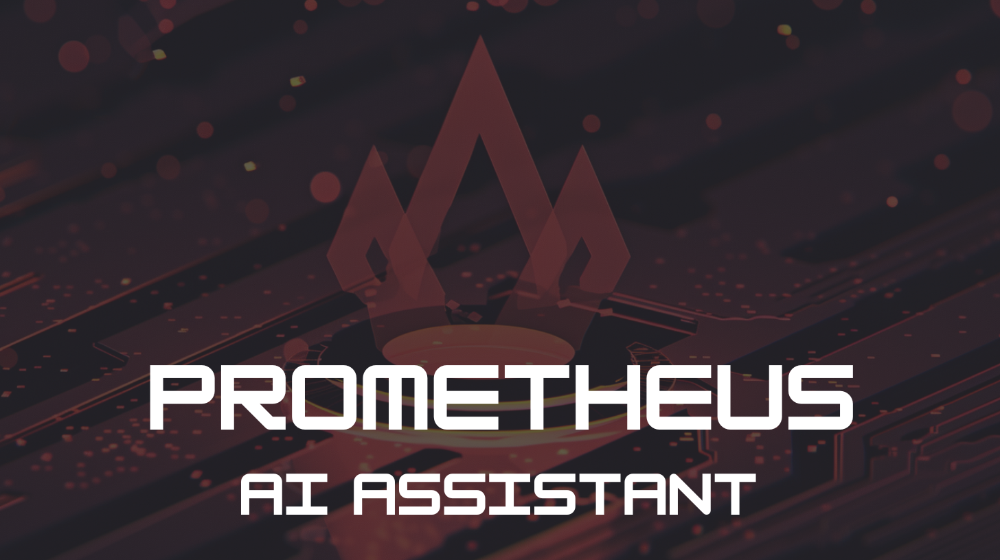

# Prometheus AI Assistant

   
   
   
Prometheus AI Assistant to help you create Alerts for your infrastructure!

## How it works

We are using a RAG (Retrieval Augmented Generation) mechanism based on data from <https://samber.github.io/awesome-prometheus-alerts/rules>

Using the vector database [FAISS](https://faiss.ai/) and [Chainlit](https://github.com/Chainlit/chainlit) for the frontend part.
