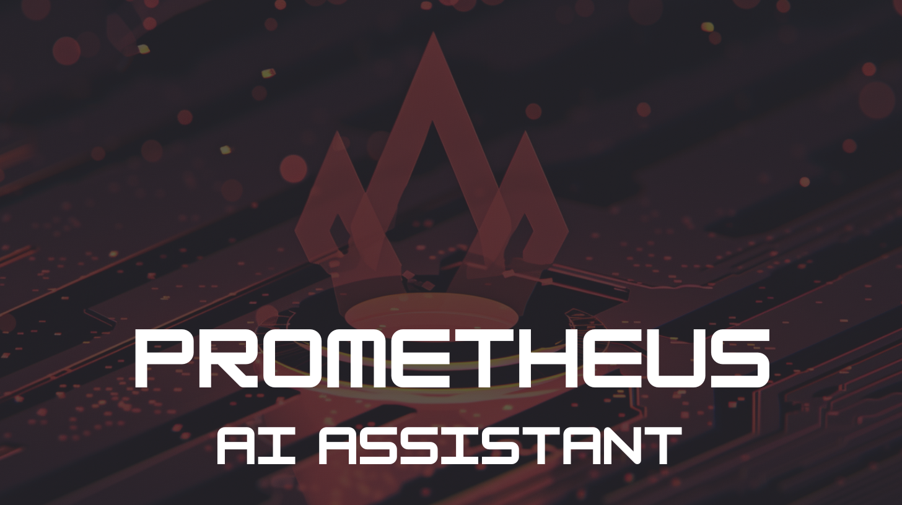

# Prometheus AI Assistant

   
   
   
Prometheus AI Assistant para ajudar na criação de Alertas para sua infraestrutura!

## Como tudo funciona?

Estamos utilizando um mecanismo de RAG (Retrivement Augmented Generation) baseado nos dados do <https://samber.github.io/awesome-prometheus-alerts/rules>

Utilizando o banco vetorial [FAISS](https://faiss.ai/) e [Chainlit](https://github.com/Chainlit/chainlit) para o frontend.
